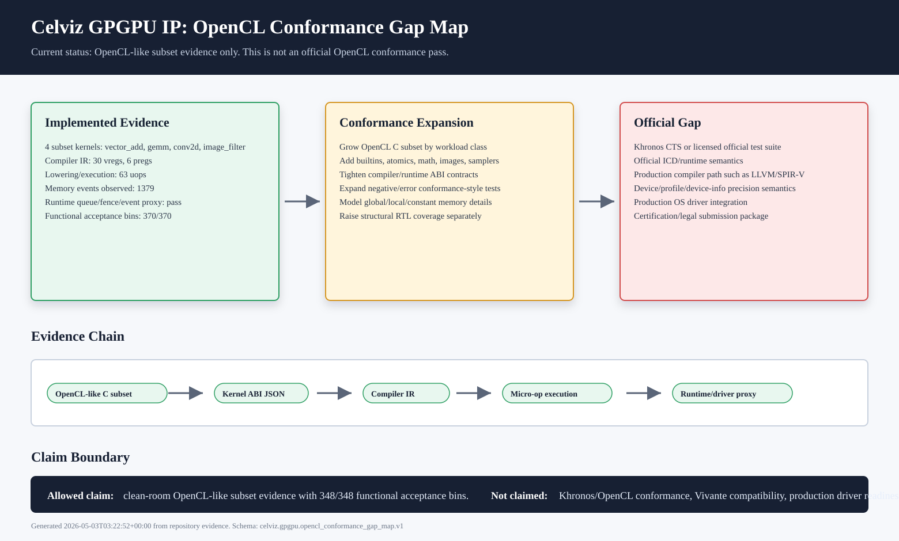

# Celviz GPGPU IP OpenCL Conformance Gap Map

Status: gap-map evidence, not an official OpenCL conformance claim.

This page records the current OpenCL-like subset evidence and the remaining
work required before official OpenCL conformance can be discussed. The diagram
is generated from repository evidence by:

```sh
bash scripts/verify_celviz_gpgpu_opencl_conformance_gap_map.sh
```



## Current Evidence

- Four OpenCL-like subset kernels: `vector_add`, `gemm`, `conv2d`, and
  `image_filter`.
- Compiler IR, kernel ABI metadata, micro-op lowering, and micro-op execution
  evidence are present and passing.
- Runtime/driver submission proxy evidence is present and passing.
- Functional/acceptance coverage evidence is `348/348 = 100.000%`.

## Gap Boundary

The diagram must be read as a conformance gap map. It supports a narrow claim:
the current repository has clean-room OpenCL-like subset evidence for the
Ventus-based Celviz GPGPU IP proxy.

It does not claim Khronos CTS pass, official OpenCL conformance, proprietary
Vivante compatibility, production driver readiness, timing closure, PPA signoff,
or silicon signoff.
