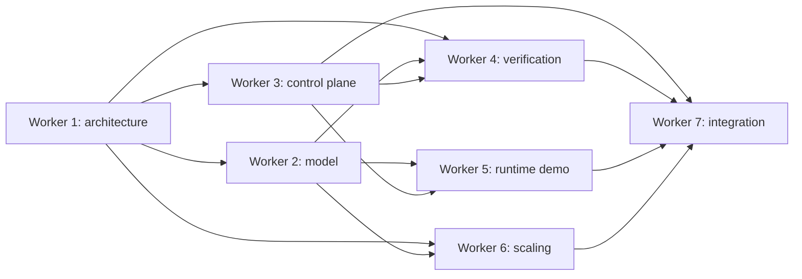

# Celviz GPGPU IP Worker Orchestration

Date: 2026-05-02

This file coordinates the seven parallel lanes for the active Rank 1 Vivante
3D GPGPU IP / Celviz GPGPU IP work package in this `ventus-gpgpu` repository.

## Boundary

- Implementation repository:
  `/Users/nirvana/Documents/New project 2/ventus-gpgpu`
- External Celviz architecture-tool reference:
  `/Users/nirvana/Desktop/codextest/celviz/tools/architecture`
- Public blueprint references:
  `/Users/nirvana/Desktop/codextest/verisilicon-ip-blueprints/blueprints/03_Vivante3DGPGPUIP.md`
  and
  `/Users/nirvana/Desktop/codextest/verisilicon-ip-blueprints/ip_execution/rank_01_vivante_3d_gpgpu_ip.md`
- Active artifact root:
  `artifacts/rank_01_vivante_3d_gpgpu_ip/`
- Active docs root:
  `docs/celviz-gpgpu-ip/`

Celviz is used as a method for decomposition, workload selection, evidence
looping, and truthful pass/pending/fail claims. It is not vendored into this
repository and is not the destination project.

The active target is Rank 1 Vivante 3D GPGPU IP. The older Rank 12 3D GPU proxy
under `docs/celviz-gpu-ip/` and `artifacts/rank_12_vivante_3d_gpu_ip/` is
historical. Keep it intact for audit context, but do not use its triangle,
texture, framebuffer, scanout, or graphics API artifacts as Rank 1 completion
evidence.

## Seven-Worker Lane Map

| Worker | Lane | Primary ownership | Main handoff |
| --- | --- | --- | --- |
| Worker 1 | Architecture decomposition | S0 architecture inventory, clean-room boundary, Ventus reuse/adapt/new/blocked/forbidden map | Layer map and scope contract for all lanes |
| Worker 2 | Compute golden model | S1 vector add, GEMM/convolution proxy, image filter, memory copy, FP32/FP16 proxy metrics, shader-unit public tier table | Deterministic oracle outputs, hashes, operation counts, byte counts |
| Worker 3 | Command/control plane | S2 OpenCL-like descriptor lowering, AXI4-Lite register/control skeleton, fence/status/fault/interrupt surface | Command submission and observable status hooks for verification |
| Worker 4 | Verification harness | S3 token contract, pass/pending/fail rules, test commands, coverage and logs | Repeatable acceptance transcript and evidence status |
| Worker 5 | Runtime/demo | S4 userspace runtime CLI, fixed kernel demo, output collection, demo hashes | OpenCL-like workload run evidence and user-facing smoke path |
| Worker 6 | Tier/scaling/performance | S1/S3/S5 shader-unit scaling, throughput proxy, scheduler occupancy, FP16/FP32 tier reporting | Tier-normalized metrics and scaling caveat language |
| Worker 7 | Integration/evidence and pivot cleanup | S5 integration evidence framework, worker dependency graph, Rank 12 supersession notice, AXI/latency/power/reset/interrupt/security summaries | AI1-ready integration map and unresolved evidence checklist |

## Dependency Graph



Integration is allowed to land while other lanes are still pending. Worker 7
must record the pending dependency, not silently upgrade it. A criterion moves
from `pending` to `started` or `pass` only when the artifact exists, the command
is recorded, and the log or metrics file contains the expected token.

## Stage Ownership

| Stage | Evidence theme | Primary workers | Current integration disposition |
| --- | --- | --- | --- |
| S0 | Public facts, clean-room scope, Ventus inventory, Rank 1 not Rank 12 | W1, W7 | Started. `ARCHITECTURE_DECOMPOSITION.md` and `spec/architecture_inventory.md` exist. |
| S1 | Golden compute model and deterministic workload metrics | W2, W6 | Pass for current software model evidence. FP16 is metadata/proxy only. |
| S2 | Command/control plane and interrupt/fence register behavior | W3 | Pending until command/control evidence lands with logs. |
| S3 | Verification harness over model/runtime/control evidence | W4 | Harness exists; combined execution remains pending until runtime/control-plane candidates align. |
| S4 | OpenCL-like runtime demo | W5 | Demo evidence exists with `status=pass`; verification harness may still need candidate path alignment. |
| S5 | SoC integration evidence: AXI, latency, power proxy, reset/clock/interrupt, safety/security non-goals | W7, W3, W6 | Framework started; quantitative RTL-backed evidence remains pending. |

## Lane Contracts

### Worker 1: Architecture

Owns the Rank 1 GPGPU target definition and the Ventus mapping. It must keep
the language compute-oriented: OpenCL-like descriptors, vector/tensor/image
compute, shader-unit scaling, FP16/FP32 proxy evidence, scheduler/runtime/model,
AXI traffic, and throughput scaling.

Required handoffs:

- Architecture layer IDs and evidence handles.
- Reuse/adapt/new/blocked/forbidden status.
- Explicit prohibition against reusing Rank 12 graphics artifacts as Rank 1
  evidence.

### Worker 2: Golden Model

Owns deterministic S1 software oracle evidence. Current landed evidence records:

- `vector_add`
- `gemm_proxy`
- `convolution_proxy` / image filter
- `memory_copy`
- FP32 operation counts and byte counts
- FP16 proxy metadata only
- Public shader-unit tier metadata

Required handoffs:

- `artifacts/rank_01_vivante_3d_gpgpu_ip/model/run.log`
- `artifacts/rank_01_vivante_3d_gpgpu_ip/model/metrics.json`
- Per-workload JSON and hashes under `model/outputs/`

### Worker 3: Command/Control Plane

Owns the clean-room control path, not a Vivante command stream. The lane should
adapt Ventus `host2CTA_data`, `AXI4Lite2CTA`, and simulator entry points into a
proxy command queue, status, fence, error, and interrupt surface.

Required handoffs:

- Command descriptor schema and register/status map.
- Completion and recoverable-fault interrupt evidence.
- Reset and clock-control behavior at proxy level.
- AXI4-Lite control transaction accounting.

### Worker 4: Verification

Owns the S3 acceptance harness and token contract. The harness may report
`pending` with exit status 0 while component lanes land independently. It must
fail only when present evidence is malformed, non-runnable, or missing required
tokens after all component boundaries are available.

Required tokens:

```text
vector_add
gemm_convolution_image_filter
memory_copy
shader_unit_scaling
fp16_fp32_paths
command_submission
interrupts
axi_traffic
throughput_scaling_by_tier
```

### Worker 5: Runtime/Demo

Owns the OpenCL-like runtime demo. Current landed evidence validates a fixed
kernel list and emits deterministic per-kernel outputs. This is a clean-room
runtime shim, not an OpenCL ICD, SDK, or conformance layer.

Required handoffs:

- `artifacts/rank_01_vivante_3d_gpgpu_ip/demo/run.log`
- `artifacts/rank_01_vivante_3d_gpgpu_ip/demo/outputs/summary.json`
- Per-kernel output hashes.

### Worker 6: Tier/Scaling/Performance

Owns public tier mapping and proxy performance reporting. It must keep public
CC8000/CC8X00 labels separate from measured local RTL performance.

Required handoffs:

- Shader-unit scaling table.
- Throughput proxy model with explicit assumptions.
- Scheduler occupancy and resource-pressure metrics when available.
- FP32 measured/model distinction and FP16 model-only caveat.

### Worker 7: Integration/Evidence

Owns the integration evidence framework and pivot cleanup. This lane connects
other worker outputs to Rank 1 S5 evidence without inventing missing proof.

Required handoffs:

- `artifacts/rank_01_vivante_3d_gpgpu_ip/integration/README.md`
- `bandwidth_latency_power.md`
- `reset_clock_interrupt.md`
- `security_safety_notes.md`
- `worker_lanes.md`
- Rank 12 supersession notice:
  `docs/celviz-gpu-ip/SUPERSEDED_BY_GPGPU.md`

## Integration Rules

1. Keep all work repo-local under `ventus-gpgpu`.
2. Do not delete or rewrite Rank 12 historical artifacts.
3. Do not claim silicon signoff, tapeout readiness, official API conformance,
   proprietary Vivante compatibility, production PPA, STA/CDC/DFT closure, or
   licensed IP equivalence.
4. Treat AXI bandwidth, kernel latency, power, and throughput as proxy evidence
   until RTL/simulation logs and measurement commands are present.
5. Treat FP16 as model/proxy metadata unless a tested RTL FP16 path is added.
6. Keep graphics artifacts out of Rank 1 pass criteria.
7. Preserve other workers' concurrent changes and adapt to the evidence they
   land.
